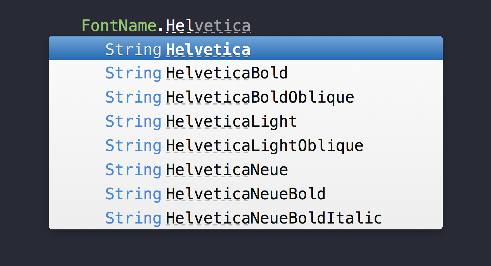

# SwiftFontName

You don't need to search font name any more with SwiftFontName. When using UIFont, you sometimes search font name string because UIFont needs string font name value. Font family name and font name don't have organized naming rule, so it's painful to search correct string. With SwiftFontName, font name candidates shows up when you put first word of font family name.

[](https://travis-ci.org/Naoki Morita/SwiftFontName)
[](http://cocoapods.org/pods/SwiftFontName)
[](http://cocoapods.org/pods/SwiftFontName)
[](http://cocoapods.org/pods/SwiftFontName)
[](https://github.com/Carthage/Carthage)



## Features

- Complements for all font names in OS version.
- Localized font name support.

## Usage

### Font Name

To start using SwiftFontName, write the following line wherever you want to user font complements:

```swift
import SwiftFontName
```

Then:

```swift
FontName.HelveticaNeueLight // HelveticaNeue-Light
```

It is really simple!

### Localized Font Name

And you can select localized font:

```swift
LocalizedFontName(FontName.Copperplate, ["ja": FontName.HiraKakuProNW6, "en": FontName.HelveticaNeueLight])
```

It means that when preferredLanguage is Japanese, use `HiraKakuProNW6`. And when preferredLanguage is English, use `HelveticaNeue-Light`. And in other case, use `Copperplate`.

## Requirements

- iOS8.0 or later
- Xcode 6.3

## Installation

SwiftFontName is available through [CocoaPods](http://cocoapods.org). To install
it, simply add the following line to your Podfile:

### [CocoaPods](http://cocoapods.org):

```ruby
use_frameworks!
pod 'SwiftFontName', '~> 1.0.0'
```

### [Carthage](https://github.com/Carthage/Carthage):

```ogdl
github "morizotter/SwiftFontName" ~> 1.0
```

### Manually

To copy `FontName.swift` and `LocalizedFont.swift` in SwiftFontName directory, you can use this library, too.

## Contribution

1. Fork
2. Create your feature branch (git checkout -b my-new-feature)
3. Commit your changes (git commit -am 'Add some feature')
4. Push to the branch (git push origin my-new-feature)
5. Create new Pull Request

## Author

Naoki Morita, namorit@gmail.com

## License

SwiftFontName is available under the MIT license. See the LICENSE file for more info.
